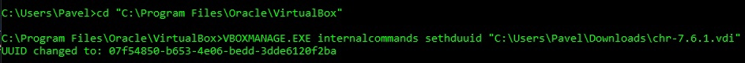
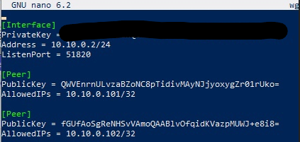
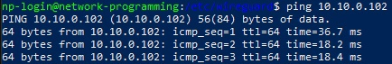
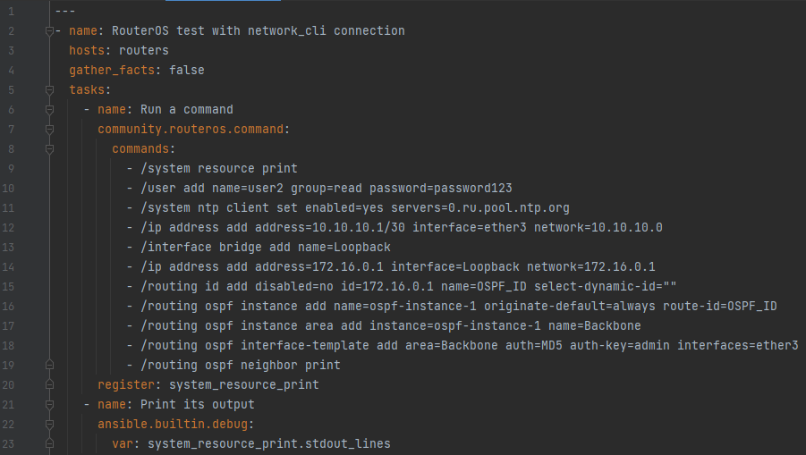
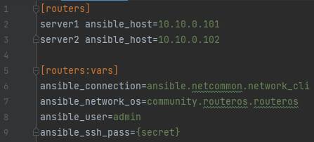
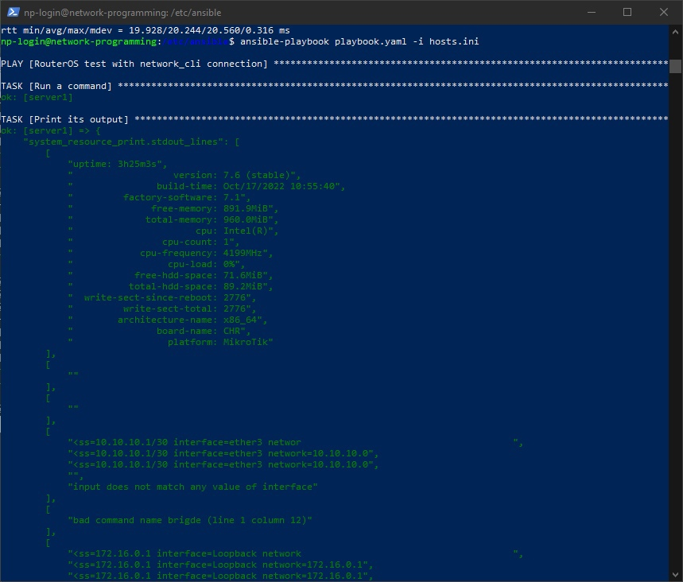
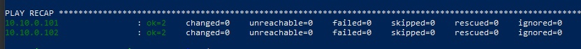
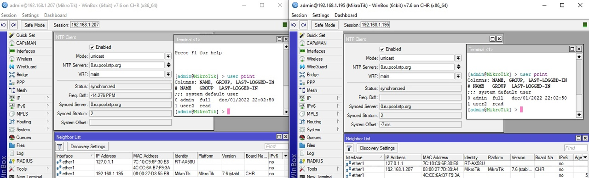

University: ITMO University  
Faculty: FICT  
Course: Network programming  
Year: 2022  
Group: K34202  
Author: Efimov Pavel Leonidovich  
Lab: Lab1  
Date of create: 28.11.2022  
Date of finished: 08.12.2022

Цель работы: С помощью Ansible настроить несколько сетевых устройств и собрать информацию о них. Правильно собрать файл Inventory.

Ход работы:
1. Был установлен второй CHR на виртуальной машине, поскольку появилась ошибка с установкой диска с одним UUID, UUID был сброшен для новой машины 

2. Был настроен VPN WireGuard на второй машине, а также настроено соединение на удаленном сервере.

3. Была проверена работа подключения второй машины

4. Был написать код в файл playbook.yaml для автоматической настройки роутеров CHR

5. Также был создан файл hosts.ini с содержанием информации о хостах для подключения и настройки

6. Была запущена команда `ansible-playbook playbook.yml -i ./hosts.ini`.
7. Получен вывод информации о выполненной работе

8. Запуск был выполнен успешно

10. Были проверены созданные значения: пользователь, NTP Клиент, OSPF, интерфейсы

11. Нарисована схема работы сети

Выводы:
В ходе выполнения лабораторной работы были с помощью Ansible настроены несколько сетевых устройств и собрана информация о них. Собран файл Inventory.