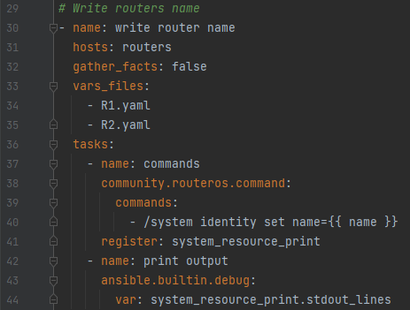
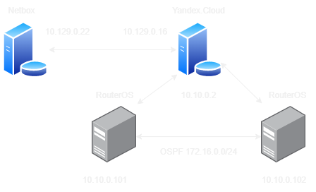

University: ITMO University  
Faculty: FICT  
Course: Network programming  
Year: 2022  
Group: K34202  
Author: Efimov Pavel Leonidovich  
Lab: Lab3  
Date of create: 12.12.2022  
Date of finished:

Цель работы: Развертывание Netbox, сеть связи как источник правды в системе технического учета Netbox.

Ход работы:

1. Была поднята вторая виртуальная машина на Yandex.Cloud, на ней установлена программа Netbox с помощью docker-compose.

2. Была проверена работа Netbox в браузере основного компьютера.

3. Были созданы сайт, роль router, мануфактура MikroTik, тип девайса RouterOS7, для создания девайсов

4. Были созданы роутеры, добавлены необходимые настройки

5. Был скачан csv файл с содержанием информации о наших девайсах, данный файл был установлен на основной компьютер с
   помощью утилиты scp. Был написана
   команда `scp C:\Users\Pavel\Downloads\netbox_devices.csv np-login@51.250.54.45:~/netbox_devices.csv`

6. Был написан скрипт для получения данных из таблицы csv и проверена его работа.

7. Был написан скрипт для изменения названия роутеров MikroTik, скрипт был запущен и проверен.

8. Скрипт успешно изменил название роутеров
9Далее был написан скрипт для записи данных в Netbox. Была проверена его работа. Поскольку виртуальные машины находятся в Yandex.Cloud, я создал отдельную сеть для их работы

10. Скрипт успешно отработал, добавив информацию в Netbox о девайсах
11. Нарисована схема сети

12. Проверена работа сети

  
Результат пинга между виртуальными машинами

  
Результаты пингов от виртуальной машины к роутерам

  
Результат пингов между роутерами

Выводы:
В ходе выполнения лабораторной работы были с помощью Ansible и Netbox собрана вся возможная информация об устройствах и сохранена в отдельном файле.
