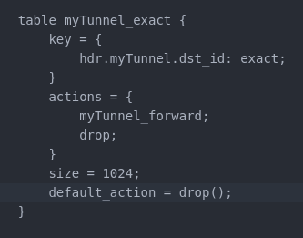

University: ITMO University  
Faculty: FICT  
Course: Network programming  
Year: 2022  
Group: K34202  
Author: Efimov Pavel Leonidovich  
Lab: Lab4  
Date of create: 18.12.2022  
Date of finished: 

Цель работы: Изучить синтаксис языка программирования P4 и выполнить 2 задания обучающих задания от Open network foundation для ознакомления на практике с P4.

Ход работы:

1. Был склонирован репозиторий и поднята виртуальная машина с помощью Vagrant
2. Был выполнен вход в аккаунт и запущена команда с `make build && make run`
3. Проверена работа mininet

4. Добавляем недостающий код в файл basic.p4
5. Добавляем в парсер заголовки ethernet_t, ipv4_t

6. Изменены адреса получателя и отправителя, уменьшен ttl и определяем выходной порт.

7. Добавляем валидацию на корректность заголовка ipv4.

8. Добавляем депарсер пакетов.

9. Проверяем работу всех изменений. Все сработало успешно.

10. Нарисована схема сети basic.p4

11. Изменяем код в файле basic_tunnel.p4
12. Реализован парсер MyTunnel, добавлено заполнение заголовка 

13. Определена функция myTunnel_forward, указан порт в метадате.

14. Определена таблица myTunnel_exact

15. Изменена валидация пакетов, отправленных через туннель

16. Добавлен депарсер для туннелей

17. Отправлен запрос и проверена работа программы

18. Нарисована схема сети

Выводы:
В ходе выполнения лабораторной работы был изучен синтаксис языка программирования P4 и выполнены 2 задания обучающих задания от Open network foundation для ознакомления на практике с P4.
